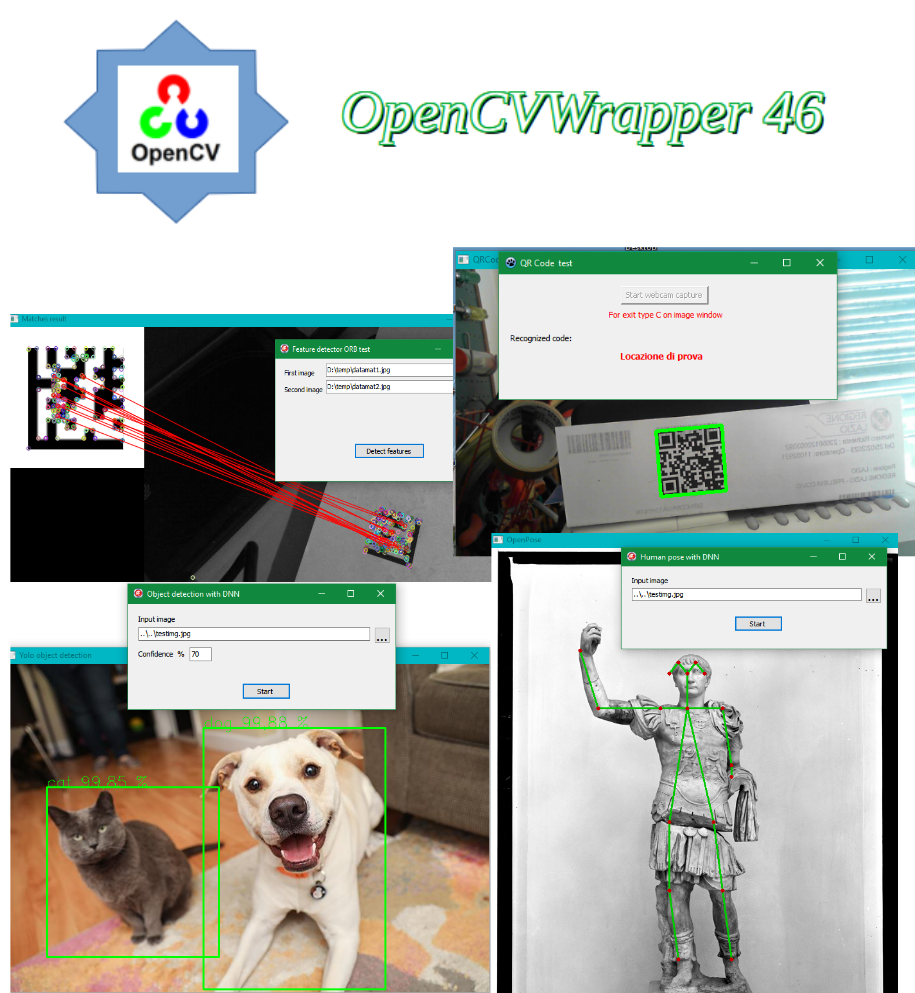

# ocvWrapper46 v 1.1

# A wrapper library around Opencv 4.6 C++ API for Delphi, Lazarus/Freepascal and C

# New version - 3/5/2023
 
  * Added four Delphi VCL components: two as image source, TOcvVideoSource and
     TOcvImageDirectory; two as image processors, TOCVProcObjectDetector and
     TOcvProcFaceDetector (also face recognizer)
  * Added a program, createFacesDB, that creates and save on disk a lightweight
    database of faces "signatures". This is needed from the face recognizer class
  * Added unOpencvDelphi46 unit with a class to wrap the Opencv image/Mat class,
    and other classes that wrap and simplify some Opencv DNN algorithms
  * Added DELPHIDELAYED define to activate in Delphi the delayed DLL load mechanism
    (so removed the separate files in Delayed directory)
     

# New version - 7/4/2023
 
  * Added scripts and instruction to build on Linux
  * For Linux, changed CopyMemory to Move in OpencvWrapper.pas
  * Added fromarray/toarray for vectors with simple types (int, char, float, double, uchar) 
  * Changed default value from 0 to nil for pointer args in Delphi/Freep. functions signatures
  * For Delphi extern declarations, added  version with "delayed" option
  * Added predefinited PCvStringEmpty variable, it can be used when want to pass an empty string as parameter

 

# Introduction

This project contains a dynamic library (DLL in Windows) that is a wrapper
around the C++ API of Opencv v 4.6 .
The library expose a pure C API interface to all C++ classes and functions of Opencv.
More than 4.000 C wrapper functions, cover vast majority of Opencv C++ classes (more than 300)
and global functions, and some standard C++ classes (as vectors).
The library is intended especially for accessing Opencv C++ API from Delphi and Freepascal units.
So in this repository there are Delphi/Freepascal units with signatures to all the wrapper C API.

# Opencv version 4.6 main features

This version contains a Deep Neural Network (DNN) module, capable of load and use all main DNN
formats: Tensorflow, Torch, Caffe, Darknet, ONNX. The neural net can be used to produce prediction
on a assigned input. Varying on net type, input can be: an image (classification, object detection
boxes, pose estimation, colorization etc.); a text (classification); and more.

The use of GPU, if any, is totally transparent. The programmer has only to use the class UMat
instead of Mat, and Opencv will use optimized code for the GPU.

The official Opencv release contains OpenCL backend to address GPU calculations. So any GPU can
be exploited: NVidia, AMD, Intel, and more.

There is a class to read and decode QR Codes. And many more new functions, plus all the standard
image processing and general functions found also in older versions. 

# Library base design

The wrapper code is based on the Python Opencv interface. So, all Opencv classes or functions
exposed to Python are also exposed in wrapper.
The code is in general divided in two parts:
- "generated" code, so called because it's automatically and totally generated from scripts using some annotations
included in Opencv C++ headers (see https://docs.opencv.org/3.0.0/da/d49/tutorial_py_bindings_basics.html). This code must not be modified by hand .
- "native" code, so called because contains base Opencv classes and also native C++ classes that are not generated
from script, but are hand written.

# Types of classes in Opencv

- standard Opencv classes: these have a standard constructor/destructor, properties with get and set, and methods.
- pointer to classes (Ptr): these pointers are returned from some "factory" global functions. So these classes
  haven't a regular constructor, and the pointer require a different treatment from standard class reference.
- Opencv structs: there are also some structs used among the C++ classes, these structs, in wrapper, for simplicity
  are treated as the standard classes, so have a pseudo constructor/destructor.
- C++ vectors: Opencv sometimes use C++ vectors, and vectors of vectors. In wrapper these are treated as standard
  classes, of course with some specific methods
  
# Wrapper implementation

Wrapper code bind a special C struct to every class, Opencv struct, Ptr or vector. The binding struct end with \"_t\" suffix.
The struct contains internally a field with the reference to the real Opencv internal entity (class, struct, ecc.).

Every Opencv/C++ class is "flattened" to a group of C functions: one for create, one for delete, one for every method, one for
every property get, and one for every property set. The create function returns the binding struct, and the delete function release the memory
allocated for the entity and for the struct iself. 

Only Ptr, as said, haven't the create function but only delete function.
When the C or Delphi caller program  invoke some method or function, it pass always as the first parameter the pointer to binding
struct, that was returned from the corresponding create function.

All C wrapper functions have the "pCv" prefix, after that the class name, after that the original Opencv method name:

  pCv\<class name\>\<method name\>
  
Properties get and set have the standard name schema:
  
  pCv\<class name\>Set_\<property name\>
  
  pCv\<class name\>Get_\<property name\>
  
Example: the standard Mat Opencv class has the binding struct called Mat_t, a constructor called pCvMatCreate 
(indeed plus many others constructors because it's a special class), and a destructor called pCvMatDelete.
  
At last, for some very simple classes or structs, with few fields, there aren't single get/set functions for every property,
but instead only two functions FromStruct and ToStruct that get or set all members from an helper C struct with a single call. So:
  
  pCv\<class name\>FromStruct
  
  pCv\<class name\>ToStruct
  
Ptr types have another specialized function that convert from Ptr entity to the standard wrapper binding struct. This because
in general all wrapper functions "understand" only the binding struct format, not Ptr.
  
For example, for Ptr_Feature2d type there is a pCvPtr_Feature2dConvert function,  that has input parameter type Ptr_feature2d and
returns a pointer to a fresh Feature2d_t binding struct. When calling a method of Feature2D class (example: pCvFeature2dcompute) 
you will use the binding struct as first parameter, not the original Ptr.
  
Note an important aspect: all binding structs created with create functions must be deleted, of course. But the same is true also for
binding structs returned directly from other wrapper functions. For example, all structs returned from properties get methods. Or
all structs returned from the functions for get elements of some vectors types, ex. vector_keypoint.

All structs not properly deleted cause memory leaks.
  

# Default parameter values management

The wrapper library has a complete management of default values for function parameters. Of course Delphi/Freepascal is
capable of setting default values of simple type (integer, float). But many functions require a C++ object as default value.

In case of class default, the Delphi/Freepascal program has only to pass a nil parameter, the wrapper library internally builds the
exact C++ class object required by Opencv as default.  


# C++ exception handling

The C++ and Opencv exceptions are handled by a special handler function in wrapper. This function always print the exception message
on standard output. If the caller application is a console one, than the error messages are visible directly in application
window. 

The handler function also call an external handler function, if registered, passing the exception message. The external function can
be registered calling the DLL function:

bool     pCvRedirectException(void * func);

If pointer "func" \> 0 the external handler is registered, if func = 0 the handler is unregistered.

The signature of external handler has to be:

void(\*customException) (string_t*)

Regarding Delphi, the main unit OPENCVWrapper.pas (see forward) during initialization registers a standard handler, that
raise a Delphi exception for every C++ or Opencv exception.
But you can register a different function, with the same signature as the unit one:

procedure cvException(msg: PCvString_t); 

(Note that the "msg" struct must not be deleted inside cvException or other user custom handler, because after completion it returns to the caller,
i.e. the wrapper handler, and this one delete the struct).

By the way, there is a trick also for Windows Delphi applications to open a console window, just insert {$APPTYPE CONSOLE}
in the project .dpr source: the forms will be displayed normally, plus a console window will be open.

# AutoDestroy utility unit

The wrapper structs, created by the various functions around the C++ objects, have to be deleted to release memory, as noted previously.
 This is same as Delphi/Freepascal, no difference.

But note that Delphi/Freepascal memory manager does not directly create these objects, so cannot report if some
C++ object delete is missing.

AutoDestroy unit add a useful mode to create wrapper structs without the need to manually call the corresponding wrapper delete
function. It exploits the well known reference counting of Delphi/Freepascal interfaces.

For now there is a function to auto destroy the ubiquitous pCvMat_t object.
Example manual delete: 
```
try   
   m := pCvMatImageCreate(w, h, CV_8UC3);   
   .............   
finally   
   pCvMatDelete(m);   
end;  
```


Example auto delete:
```
try      
    m := CvMatAuto(pCvMatImageCreate(w, h, CV_8UC3)).AsPtr;      
    .............   
finally      
   // no delete needed     
end;       
```    


# Installation (Windows)

Prerequisites to use provided DLL binaries:


- Opencv version 4.6
- Visual C++ 2017 runtime 


Download Opencv version 4.6 from https://sourceforge.net/projects/opencvlibrary/files/4.6.0/opencv-4.6.0-vc14_vc15.exe/download
NOTE: the official Opencv version has only 64 bit binaries. In this repository, directory Opencv4.6-x86 contains the
32 bit binaries

Install Opencv, and add in Windows path the directory with Opencv DLL (for example: C:\opencv4.6\build\x64\vc14\bin):

  set path=C:\opencv4.6\build\x64\vc14\bin;%path%

Download this repository and add in Windows path the directory with ocvWrapper46x64.dll .
For example, if you have copied repository in C:\ocvWrapper, then:

  set path=C:\ocvWrapper46\bin\Release\x64

Now Opencv and ocvWrapper can be used from every program.

If you haven't Visual C++ runtime, download and install from here:

https://learn.microsoft.com/it-it/cpp/windows/latest-supported-vc-redist?view=msvc-170

WARNING! 64 bit applications could raise error "0xc000007b" if in the path the FIRST ocvWrapper or Opencv directory is the one for 32 bit. Same 
error if a 32 bit application find in path a 64 bit DLL. 

# Delphi use

To use ocvWrapper from Delphi only add the main unit OPENCVWrapper.pas to Uses clause
of program.
Other .pas files are included directly from OPENCVWrapper.pas 
In main unit there are many definitions of "fake" records, named as
__inter__xx . They served only as a trick to force the Delphi IDE and compiler to discriminate
the various "opaque" pointers to wrapper structures. 

Without the trick, all that pointers are only .... pointers, not different one from another!
So IDE cannot help in code suggestion, and compiler cannot catch wrong use.


# Example programs

- testKNN: a pure C program that use the K Nearest Neighbors class from Machine Learning module (ML)

- testPCA: a Delphi/Lazarus program for testing the PCA class from ML module

- testSVM: a Delphi/Lazarus program for testing CvSVM class from ML module

- featureTest: a Delphi/Lazarus demo program for ORB feature detector class and matching between images

- cascadeTest: a Delphi/Lazarus demo program for face recognition on webcam, by cascade classifier class

- skeletonize: a Delphi/Lazarus demo program that reduces an image to its more basic contours ("skeleton")

- camshiftdemo: a Delphi/Lazarus demo program, adapted from a classical Opencv example; the program tracks
  movements of a selected area in real time on webcam, for example the face of person in front of webcam 
  
- qrcodeTest: a Delphi/Lazarus demo that identify and decode QR-CODEs on webcam

- testGPU: a Delphi/Lazarus demo that measures the performances improvement using GPU capable Opencv UMat

- dnnObjectDetection: a Delphi/Lazarus demo program for the DNN module with Yolo object detection neural net

- dnnOpenPose: a Delphi/Lazarus demo program for the DNN module with Coco human pose detection neural net

- dnnRecolorize: a Delphi/Lazarus demo program for the DNN module with a neural net that colorize gray images


# Windows - Build from sources

The library can be rebuilt using the Visual C++ 2017 project in ocvCPPWrapper46 directory.
Only dependence are the headers, from Opencv source directory, and .lib files of Opencv, found in  \build 
directory of Opencv.

# Linux - Build from sources

Many thanks to Fred "Jurassic Pork", that prepared and tested the build scripts.

  Tested with:  
  * Ubuntu 20   
  * Xubuntu 22   

  1) Install minimal prerequisites (Ubuntu 20.04 as reference)   
     sudo apt update && sudo apt install -y cmake g++ wget unzip    
  2) Download and unpack Opencv 4.6 sources in your home directory:   
     wget -O opencv.zip https://github.com/opencv/opencv/archive/4.6.0.zip   
     unzip opencv.zip    
  3) Download ocvWrapper46 repository from github in your home      
  4) in install.sh set your home folder, Opencv source folder and ocvWrapper folder  
  5) change install.sh permission to executable:   
     chmod a+x install.sh   
  6) run install.sh:    
     ./install.sh    

  At end you will have Opencv libraries and libocvWrapper46.so installed in
  /usr/lib


