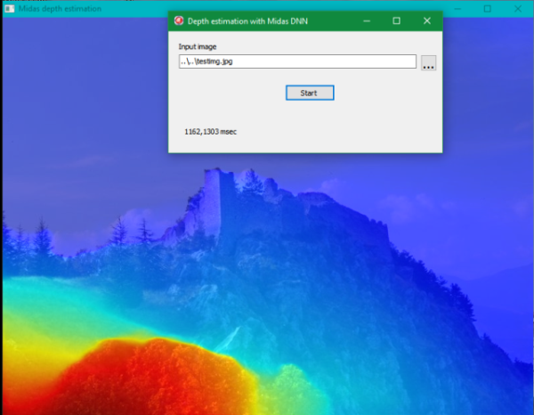

# ocvWrapper46 v 1.2

# A wrapper library around Opencv 4.6 C++ API for Delphi, Lazarus/Freepascal and C

# New version - 18/10/2024

   Delphi/FPC sources and examples:
   * added a new component for Delphi and Lazarus that write a movie from
     an image source; see package in Delphi-components or Lazarus-components
   * added an example showing how write webcam video in a file, using the new component
   * updated docs

# New version - 21/4/2024

   Delphi/FPC sources and examples:
   * added Pascal classes for vectors and Ptrs (TOcvVector, TOcvPtr)
     Note: the classes use generics and require FPC 3.3.1 or superior
   * added an example showing how to use Pascal classes: featureTestWithClasses
   * detailed docs on vectors and Ptrs
 

# New version - 15/12/2023
  
   C++ sources:
   * ocvWrp_nativeNotGen.h, ocvWrp_nativeNotGen_signatures.h : added parameter "mask" to PCvMatCopy function; 
                 added parameter "channel" to PCvMatGetx/pCvMatSetx functions
   * ocvWrp_c_generated_const.h: added constants for all types of Mat
   
   Binaries:
   * recompiled all DLL

   Delphi/FPC sources and examples:

   *  unOcvWrapper_const.pas: added constants for all types of Mat
   *  OpencvWrapper.pas: added parameter "mask" to PCvMatCopy function;  added parameter "channel" 
       to PCvMatGetx/pCvMatSetx functions
   *  Pascal-classes\unOCVImage.pas: new class TOCVParamMat; many new methods for TOCVImage
   *  Pascal-classes\ocvWrapComp.pas: added reference to new unit unOCVImage
   *  Pascal-classes\unOpenCVDelphi46.pas: moved TOCVImage class to new unit unOCVImage; fixed some minor bugs
   *  Pascal-classes\unOCVContours.pas: new class for OpenCV contours
   *  frameRecon: new project Delphi/Lazarus that find the transformation matrix
       (homography) between a camera image and corresponding horizontal image (floor)
   

   Also added a new directory pasdoc with documentation on Pascal classes.

# New version - 28/8/2023
 
  * Added scripts to compile library under Apple MacOS. Kindly contributed by user "havezet".
    This require also a modify in OpencvWrapper.pas conditionals for FPC/Lazarus: changed symbol LINUX with more
    general UNIX; added lines to link library in MacOS

# New example - 27/6/2023

  * Added an example using Midas DNN, that estimates depth (distances)  
    in a photo. Red points are points closer to observer,   
    blu points are farther.

# New version - 3/5/2023
 
  * Added four Delphi VCL/Lazarus components: two as image source, TOcvVideoSource and
     TOcvImageDirectory; two as image processors, TOCVProcObjectDetector and
     TOcvProcFaceDetector (also face recognizer)
  * Added a program, createFacesDB, that creates and save on disk a lightweight
    database of faces "signatures". This is needed from the face recognizer class
  * Added unOpencvDelphi46 unit with a class to wrap the Opencv image/Mat class,
    and other classes that wrap and simplify some Opencv DNN algorithms
  * Added DELPHIDELAYED define to activate in Delphi the delayed DLL load mechanism
    (so removed the separate files in Delayed directory)
     

# New version - 7/4/2023
 
  * Added scripts and instruction to build on Linux
  * For Linux, changed CopyMemory to Move in OpencvWrapper.pas
  * Added fromarray/toarray for vectors with simple types (int, char, float, double, uchar) 
  * Changed default value from 0 to nil for pointer args in Delphi/Freep. functions signatures
  * For Delphi extern declarations, added  version with "delayed" option
  * Added predefinited PCvStringEmpty variable, it can be used when want to pass an empty string as parameter

 

# Introduction

This project contains a dynamic library (DLL in Windows) that is a wrapper
around the C++ API of Opencv v 4.6 .
The library expose a pure C API interface to all C++ classes and functions of Opencv.
More than 4.000 C wrapper functions, cover vast majority of Opencv C++ classes (more than 300)
and global functions, and some standard C++ classes (as vectors).
The library is intended especially for accessing Opencv C++ API from Delphi and Freepascal units.
So in this repository there are Delphi/Freepascal units with signatures to all the wrapper C API.

# Opencv version 4.6 main features

This version contains a Deep Neural Network (DNN) module, capable of load and use all main DNN
formats: Tensorflow, Torch, Caffe, Darknet, ONNX. The neural net can be used to produce prediction
on a assigned input. Varying on net type, input can be: an image (classification, object detection
boxes, pose estimation, colorization etc.); a text (classification); and more.

The use of GPU, if any, is totally transparent. The programmer has only to use the class UMat
instead of Mat, and Opencv will use optimized code for the GPU.

The official Opencv release contains OpenCL backend to address GPU calculations. So any GPU can
be exploited: NVidia, AMD, Intel, and more.

There is a class to read and decode QR Codes. And many more new functions, plus all the standard
image processing and general functions found also in older versions. 

# Library base design

The wrapper code is based on the Python Opencv interface. So, all Opencv classes or functions
exposed to Python are also exposed in wrapper.
The code is in general divided in two parts:
- "generated" code, so called because it's automatically and totally generated from scripts using some annotations
included in Opencv C++ headers (see https://docs.opencv.org/3.0.0/da/d49/tutorial_py_bindings_basics.html). This code must not be modified by hand .
- "native" code, so called because contains base Opencv classes and also native C++ classes that are not generated
from script, but are hand written.

# Docs on general arguments

[General documentation](./General-documentation.md)

# Docs on Opencv Mat class and corresponding Pascal classes

[Notes on Matrices](./Matrices.md)

# Docs on Opencv/C++ vector classes and corresponding Pascal classes

[Notes on vectors](./Vectors.md)

# Docs on Opencv/C++ Ptr classes and corresponding Pascal classes

[Notes on Ptr](./Ptrs.md)

# Detailed docs on all Delphi/FPC functions and classes

Inside the pasdoc directory, in HTML format.

# Installation (Windows)

Prerequisites to use provided DLL binaries:

- Opencv version 4.6
- Visual C++ 2017 runtime 

Download Opencv version 4.6 from https://sourceforge.net/projects/opencvlibrary/files/4.6.0/opencv-4.6.0-vc14_vc15.exe/download
NOTE: the official Opencv version has only 64 bit binaries. In this repository, directory Opencv4.6-x86 contains the
32 bit binaries

Install Opencv, and add in Windows path the directory with Opencv DLL (for example: C:\opencv4.6\build\x64\vc14\bin):  

  set path=C:\opencv4.6\build\x64\vc14\bin;%path%

Download this repository and add in Windows path the directory with ocvWrapper46x64.dll .
For example, if you have copied repository in C:\ocvWrapper, then:

  set path=C:\ocvWrapper46\bin\Release\x64

Now Opencv and ocvWrapper can be used from every program.

If you haven't Visual C++ runtime, download and install from here:

https://learn.microsoft.com/it-it/cpp/windows/latest-supported-vc-redist?view=msvc-170

WARNING! 64 bit applications could raise error "0xc000007b" if in the path the FIRST ocvWrapper or Opencv directory is the one for 32 bit. Same 
error if a 32 bit application find in path a 64 bit DLL. 

# Windows - Build from sources

The library can be rebuilt using the Visual C++ 2017 project in ocvCPPWrapper46 directory.
Only dependence are the headers, from Opencv source directory, and .lib files of Opencv, found in  \build 
directory of Opencv.

# Linux - Build from sources

Many thanks to Fred "Jurassic Pork", that prepared and tested the build scripts.

  Tested with:  
  * Ubuntu 20   
  * Xubuntu 22   

  1) Install minimal prerequisites (Ubuntu 20.04 as reference)   
     sudo apt update && sudo apt install -y cmake g++ wget unzip    
  2) Download and unpack Opencv 4.6 sources in your home directory:   
     wget -O opencv.zip https://github.com/opencv/opencv/archive/4.6.0.zip   
     unzip opencv.zip    
  3) Download ocvWrapper46 repository from github in your home      
  4) in install.sh set your home folder, Opencv source folder and ocvWrapper folder  
  5) change install.sh permission to executable:   
     chmod a+x install.sh   
  6) run install.sh:    
     ./install.sh    

  At end you will have Opencv libraries and libocvWrapper46.so installed in
  /usr/lib

# Example programs

- testKNN: a pure C program that use the K Nearest Neighbors class from Machine Learning module (ML)

- testPCA: a Delphi/Lazarus program for testing the PCA class from ML module

- testSVM: a Delphi/Lazarus program for testing CvSVM class from ML module

- featureTest: a Delphi/Lazarus demo program for ORB feature detector class and matching between images

- cascadeTest: a Delphi/Lazarus demo program for face recognition on webcam, by cascade classifier class

- skeletonize: a Delphi/Lazarus demo program that reduces an image to its more basic contours ("skeleton")

- camshiftdemo: a Delphi/Lazarus demo program, adapted from a classical Opencv example; the program tracks
  movements of a selected area in real time on webcam, for example the face of person in front of webcam 
  
- qrcodeTest: a Delphi/Lazarus demo that identify and decode QR-CODEs on webcam

- testGPU: a Delphi/Lazarus demo that measures the performances improvement using GPU capable Opencv UMat

- dnnObjectDetection: a Delphi/Lazarus demo program for the DNN module with Yolo object detection neural net

- dnnOpenPose: a Delphi/Lazarus demo program for the DNN module with Coco human pose detection neural net

- dnnRecolorize: a Delphi/Lazarus demo program for the DNN module with a neural net that colorize gray images

